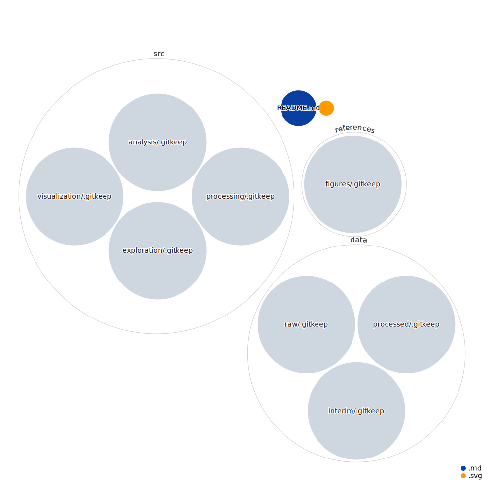

# About this project
This "project" is a template research project repository. Some reccomendations for best use: 
* Zip your raw data files when storing them in GitHub—unzip when using them locally. 
* Make a team within our organization in which members have Maintain or Admin privileges for the repository they are working in for their project. 
* Adhere to a file naming convention within your project and document it in a conventions.MD file in your project repository. 

# About this Repository

